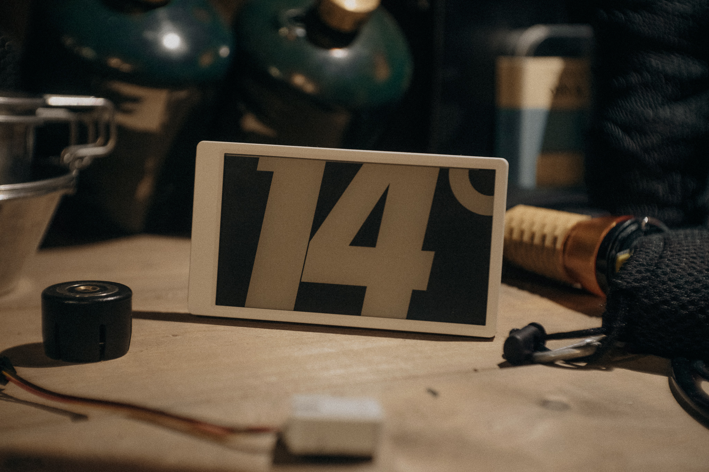
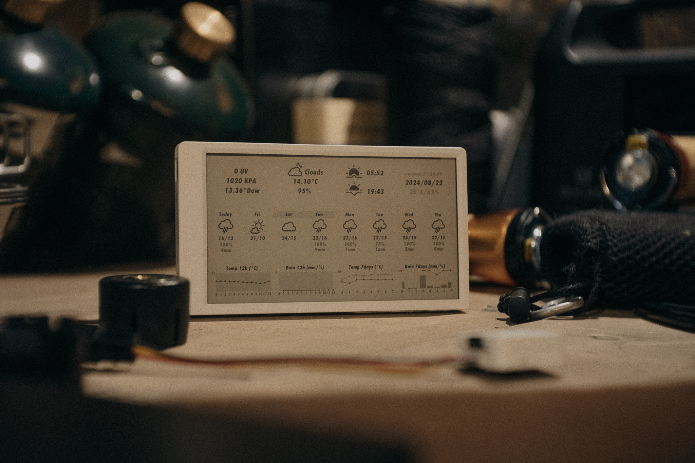
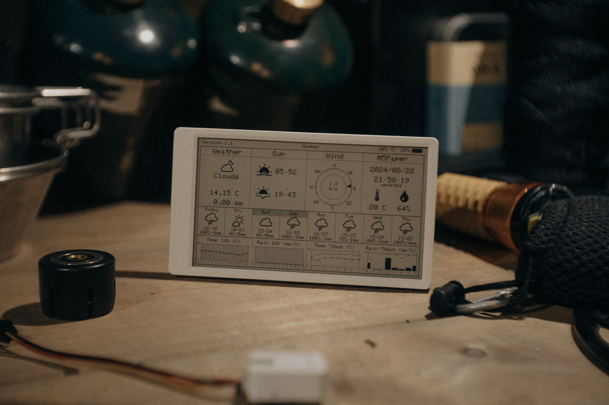
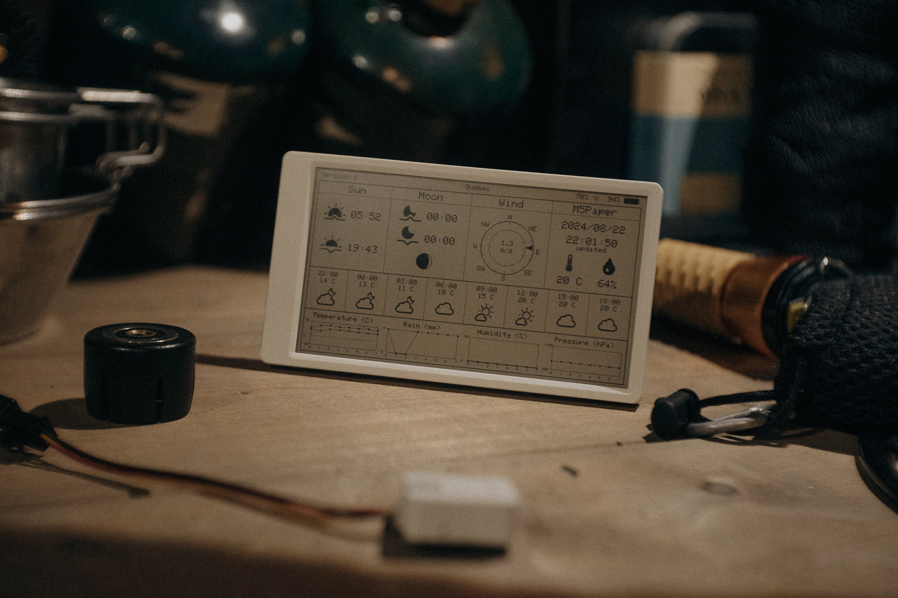

Originally forked from [https://github.com/Bastelschlumpf/M5PaperWeather](https://github.com/Bastelschlumpf/M5PaperWeather) and [https://github.com/mzyy94/M5PaperWeatherr](https://github.com/mzyy94/M5PaperWeather)

## M5PaperWeather
My takes on that great project thanks to the original forks of forks, see above.
- The librairies has been upgraded.
- I’ve added two view and kept the two forked views and it’s simple two swap between them. Simply uncomment/comment the declaration inside the lines 28 to 31 in main.cpp
- pio run -t upload

## Minimalist
   

## Engineer

   

## mzyy94

   

   ## Bastelschlumpf

   

Originally forked from [https://github.com/Bastelschlumpf/M5PaperWeather](https://github.com/Bastelschlumpf/M5PaperWeather) and [https://github.com/mzyy94/M5PaperWeatherr](https://github.com/mzyy94/M5PaperWeather)
### Description
Shows internal environment data and weather information from openweathermap https://openweathermap.org on your magnificent M5Paper.
  Please copy the **Config.hpp** file, rename it to ConfigOverride.hpp, and edit it with your own data.
  You need an api key from openweathermap.

  The information will be updated every hour or manually by pressing a button _[NEW]_.

### License
   This program is licensed under GPL-3.0

### Thanks
   * https://www.arduino.cc
     *Thanks to the Arduino community with all its incredible possibilities and support.** 
   * Special thanks for the drawing function of the moon and the wind section from David Bird
     https://github.com/G6EJD/ESP32-Revised-Weather-Display-42-E-Paper
